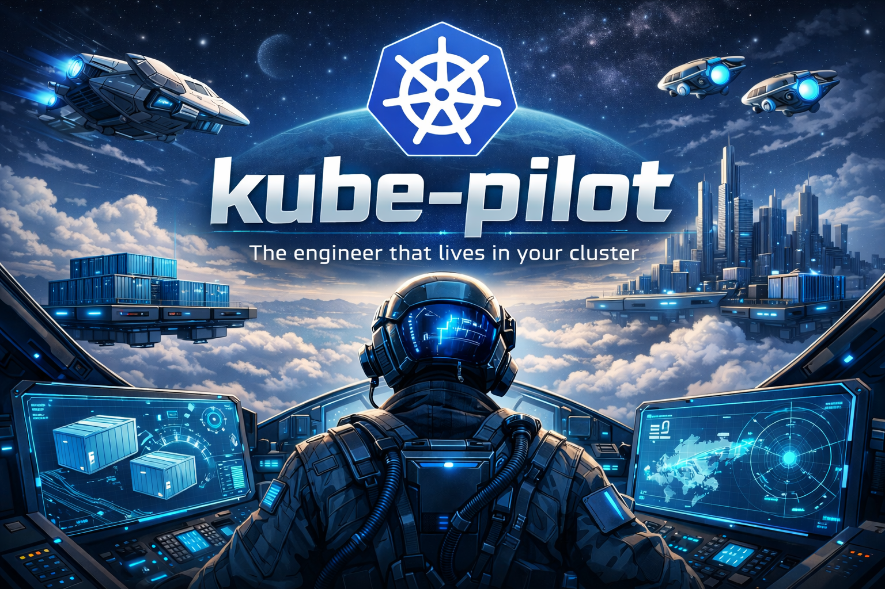

# kube-pilot

> **This is a proof of concept.** It works — we've deployed a full multi-service app from scratch on a single k3s node — but it's early. Expect rough edges.

**A headless AI engineer that runs in your Kubernetes cluster with access to all your dev tools.**

There's no UI. You talk to it the way you already work — file a GitHub issue, and it picks it up, writes the code, builds the container, deploys it, verifies it's running, and closes the ticket. If it crashes, it reads the logs, fixes the bug, and redeploys. Slack and Jira integrations are coming*.

```
You (GitHub issue): "Build a Go REST API for document storage. Deploy it to the cluster."

kube-pilot:
  1. Creates the repo, writes main.go + Dockerfile
  2. Commits and pushes to Gitea
  3. Creates a Tekton TaskRun → Kaniko builds the image → pushes to registry
  4. Writes Deployment + Service manifests → commits to infra repo
  5. ArgoCD syncs → pods come up
  6. Curls the endpoint → 200 OK
  7. Comments "Done. docs-api running at docs-api.default.svc:8080" → closes issue
```

---

## What makes this different

AI coding tools generate code. Then you copy it, build it, deploy it, debug it, and iterate manually. The feedback loop is broken.

kube-pilot closes the loop. It lives inside the cluster with direct access to every tool in your dev stack — git, CI/CD, container registry, deployment pipelines, kubectl, monitoring. You communicate with it through the tools you already use (GitHub, Slack*, Jira*), and it acts with all the tools in your cluster.

| AI coding tools | kube-pilot |
|----------------|------------|
| Generates code | Generates code |
| You build it | Builds it (Tekton + Kaniko) |
| You deploy it | Deploys it (git push + ArgoCD) |
| You debug it | Reads logs, fixes, redeploys |
| You verify it | Curls endpoints, checks health |
| You close the ticket | Closes the ticket |

It's not an ops bot. It's not a chatbot with kubectl access. It's an autonomous software engineer that happens to live inside your cluster.

### Why Kubernetes is the perfect reasoning surface for AI

Kubernetes clusters are already built around the primitives that AI agents need: declarative state, observable outcomes, and deterministic tooling. Every action has a verifiable result — `kubectl get pods` tells you if the deploy worked, `curl /healthz` tells you if the service is alive, build logs tell you exactly what failed. There's no ambiguity.

This is what makes Kubernetes fundamentally different from a local dev environment as an AI substrate. The entire dev stack — git, CI/CD, container builds, deployment, networking, secrets, observability — is API-addressable and composable. An LLM doesn't need a GUI or IDE. It needs tools that take structured input and return structured output. That's what Kubernetes is.

kube-pilot doesn't bolt AI onto an existing workflow. It uses the cluster itself as the reasoning environment — every tool call produces observable state that feeds back into the next decision. The cluster isn't just where code runs. It's where the agent thinks.

---

## How it works

```
  Issue opened             kube-pilot                     Cluster
  (GitHub/Gitea/Slack*)    (AI agent)
       │                       │
       │    webhook            │
       ├──────────────────────►│
       │                       │──── reads AGENTS.md (repo conventions)
       │                       │──── loads prior insights (cross-session memory)
       │                       │
       │                       │──── LLM decides what to do
       │                       │         │
       │                       │         ├── writes code
       │                       │         ├── git commit + push
       │                       │         ├── Tekton builds image
       │                       │         ├── updates infra repo
       │                       │         │
       │                       │         ▼
       │                       │     ArgoCD syncs ──────► Pods running
       │                       │         │
       │                       │         ├── kubectl get pods ✓
       │                       │         ├── curl /healthz ✓
       │                       │         │
       │   "Done" + close      │◄────────┘
       │◄──────────────────────│
```

Triggers can also come from **Alertmanager*** — a firing alert (e.g. pod crash loop, high error rate) becomes an issue that kube-pilot investigates and fixes autonomously.

### The agent loop

kube-pilot is a tool-calling agent. The LLM receives the task, decides what tools to call (`exec`, `git_comment`, `read_file`, `create_pr`, etc.), executes them, observes the results, and iterates. If a build fails, it reads the logs and fixes the code. If a deployment crashes, it checks `kubectl describe` and adjusts the manifests. It runs up to 75 steps before giving up.

### What's in the box

One `helm install` gives you:

| Component | Role |
|-----------|------|
| **kube-pilot** | AI agent — webhook handler, LLM tool-calling loop, shell access |
| **Gitea** | Git server + container registry (no external dependencies) |
| **Tekton** | Container image builds via Kaniko TaskRuns |
| **ArgoCD** | GitOps — watches infra repo, syncs manifests to cluster |
| **Vault** | Secrets storage (optional) |
| **External Secrets** | Vault → Kubernetes secret sync (optional) |

Everything runs in-cluster. No public URLs. No SaaS accounts. No Docker Hub.

---

## Features

### Repo-aware context
kube-pilot reads `AGENTS.md` from each repo before starting work. Tell it your conventions, your tech stack, your deployment patterns — it follows them.

```markdown
# AGENTS.md
- This is a Go 1.22 service using Chi router
- Tests run with `go test ./...`
- Container images go to the Gitea registry
- Deploy via ArgoCD, manifests in the infra repo under apps/
```

### Plan-first workflow
Label an issue `kube-pilot:plan-first` and the agent will post a plan as a comment and wait. Reply `@kube-pilot lgtm` to approve, then it executes.

### Cross-session memory
kube-pilot remembers what it learns. If it discovers that a repo needs a specific build flag, or that a service crashes without a particular env var, it saves that insight and uses it next time.

### Mid-flight context injection
If a second comment arrives while the agent is working, it gets injected into the running conversation — the agent adjusts its approach without restarting.

### Credential scrubbing
Before posting any comment or PR, kube-pilot scrubs known secrets and common credential patterns. Passwords, tokens, and API keys are redacted before they reach the LLM or any public output.

### Automatic retry with backoff
Rate-limited by the LLM provider? kube-pilot retries with exponential backoff and respects `Retry-After` headers. No dropped tasks.

### Failure recovery
If the agent crashes or hits an error, it posts a failure notice on the issue so nothing is silently orphaned.

---

## Quick start

### Prerequisites

- A Kubernetes cluster (k3s, kind, EKS, GKE — anything with 4GB+ RAM)
- `helm` and `kubectl`
- An LLM API key (Claude, OpenAI, or any OpenAI-compatible endpoint)

### Install

```bash
helm install kube-pilot ./charts/kube-pilot \
  --namespace kube-pilot --create-namespace \
  --set llm.apiKey="$ANTHROPIC_API_KEY" \
  --set gitea.gitea.admin.password="your-password"
```

kube-pilot bootstraps itself: creates git repos, registers webhooks, and starts listening. No manual setup.

### Give it a task

```bash
kubectl port-forward svc/kube-pilot-gitea-http -n kube-pilot 3000:3000
```

Open `localhost:3000`, go to any repo, create an issue with the `kube-pilot` label:

> **Title:** Deploy a hello-world web server
>
> **Body:** Build a Go HTTP server that responds with `{"message":"hello"}` on port 8080. Deploy it to the default namespace.

Watch the issue. kube-pilot picks it up, does the work, and closes it when done.

---

## Demo: CloudDesk office suite

We built **CloudDesk** — a multi-service office productivity suite — to demonstrate kube-pilot deploying and managing a real application across multiple repos. The source code and sample issues are in the [`demo/`](demo/) directory.

| Service | What it does |
|---------|-------------|
| **auth-service** | JWT authentication — login, verify, logout |
| **docs-api** | Document storage — CRUD REST API |
| **notifications-worker** | Background job processor — webhook notifications |
| **web-gateway** | API gateway — routes traffic to backend services |

The [`demo/issues/`](demo/issues/) directory has five sample issues that progressively demonstrate what kube-pilot can do — from deploying a service from scratch, to adding rate limiting, to debugging a crashing endpoint, to coordinating changes across all four services.

See [`demo/README.md`](demo/README.md) for the full walkthrough.

---

## Configuration

### LLM provider

Any OpenAI-compatible API:

```yaml
llm:
  provider: anthropic        # or openai, ollama
  baseURL: https://api.anthropic.com
  model: claude-sonnet-4-6
  apiKey: ${LLM_API_KEY}
```

Currently tested with Claude (Anthropic). Should work with any OpenAI-compatible endpoint (GPT-4, Ollama, LiteLLM, vLLM). For Ollama, point `baseURL` at your Ollama service and pick a model.

### Git provider

Bundled Gitea (default) or external GitHub:

```yaml
git:
  provider: gitea    # or github

# GitHub mode:
github:
  repos:
    - your-org/your-repo
  webhookSecret: ${WEBHOOK_SECRET}
```

### Cross-session memory

```yaml
context:
  enabled: true
  repo: kube-pilot/kube-pilot-context   # where insights are stored
  agents_file: AGENTS.md                # repo conventions file
```

### Toggle components

Everything is optional:

```yaml
gitea:
  enabled: true        # Bundled git + registry
argocd:
  enabled: true        # GitOps deployments
tekton:
  enabled: true        # CI/CD pipelines
vault:
  enabled: true        # Secrets management
externalSecrets:
  enabled: true        # Vault → k8s secret sync
```

---

## Safety model

kube-pilot is **read-only against the cluster** for persistent changes. All mutations go through git:

- Every change is auditable (git history)
- Every change is reversible (git revert)
- ArgoCD is the only thing that writes to the cluster
- Exception: Tekton TaskRuns (CI jobs), created directly by kube-pilot
- Credentials are scrubbed before reaching the LLM and before any public output (comments, PRs)
- Bot ignores its own webhook events (no self-triggering loops)

---

## Architecture

```
internal/
├── agent/          # LLM tool-calling loop, system prompt, tool execution
├── bootstrap/      # Zero-config setup — creates repos, webhooks, infra
├── config/         # YAML configuration parsing
├── context/        # Cross-session memory store (Gitea-backed)
├── controller/     # Webhook handler, issue routing, plan-first workflow
├── llm/            # OpenAI-compatible client with retry/backoff
└── tools/          # Gitea client, GitHub client, shell executor
```

**83 unit tests** across all packages. Every feature is tested.

---

## Roadmap

- [x] Autonomous build → deploy → verify loop
- [x] Repo-aware context (AGENTS.md)
- [x] Plan-first approval workflow
- [x] Cross-session memory
- [x] Mid-flight context injection
- [x] Credential scrubbing
- [x] Rate limit retry with backoff
- [x] Failure recovery notifications

**Integrations:**
- [ ] Slack* — receive tasks and post updates in channels
- [ ] Jira* — pick up tickets, update status, link PRs
- [ ] Alertmanager* — auto-create issues from firing alerts, kube-pilot investigates and fixes
- [ ] GitHub webhook mode (currently Gitea-native, GitHub via polling)

**Observability:**
- [ ] Prometheus metrics — agent runs, step counts, success/failure rates
- [ ] Grafana dashboards — task throughput, LLM latency, build times
- [ ] Loki log aggregation — structured agent logs with trace IDs

**Infrastructure:**
- [ ] Multi-environment hub & spoke — central kube-pilot managing dev/staging/prod clusters via Crossplane
- [ ] Web UI for task history and observability
- [ ] Self-management (kube-pilot upgrades itself via ArgoCD)

*\* Planned — not yet implemented*

---

## Development

Most of kube-pilot's codebase was developed using [Claude Code](https://claude.com/claude-code) for budget reasons — running kube-pilot itself for every code change burns LLM tokens. kube-pilot has been tested end-to-end on its own cluster (writing code, building images, deploying services, and closing issues autonomously), but day-to-day development used Claude Code to keep API costs down.

---

## License

MIT
